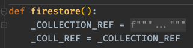

# Bugs

## Misbehavior
- [ ] `tw python slots` should work even though `slots` is a python.datamodel.special_method_names() variable
- [ ] `tw sed` prints restructured_text and not `bash > sed`. Should give more weight to next-level page if exact match.
- [ ] `tw vim delete` doesn't hit `deletion` variable. Not fuzzy enough.

## Exceptions
- [ ] `AttributeError: 'VariablePage' object has no attribute '__pages__'` 
  - [ ] `tw pydantic validators` (pydantic is a static function in `pages.py`, with one `validator` var, no return)
- [ ] `AttributeError: 'FilePage' object has no attribute '__pages__'`
  - [ ] `tw bash eof`
- [ ] `tw pylint` there was no such page anywhere. it fuzzy searches all pages in pages.py, fails CalledProcessError with exit 1, then breaks on `get_local_variables()` because `joined_str` is a `Name(id='_COLLECTION_REF', ctx=Load())`. up the stack, we see we were called by `eval_node()` after `eval(unparsed_value, globals_)` raised a NameError. this is because `unparsed_value` is a str: `'_COLLECTION_REF'`. This is because: 
- [ ] `tw argparse` just doesn't find `python > argparse`
- [ ] `RuntimeError: MergedPage.merge_sub_pages, one of the sub-pages is a MergedPage!`
  - [ ] `tw pygments`
