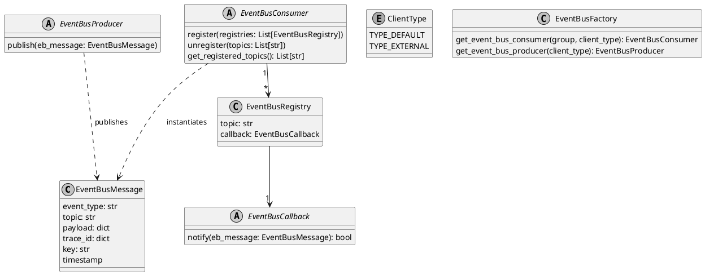
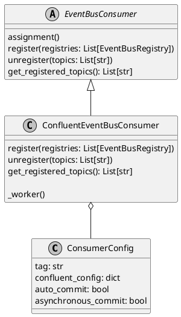
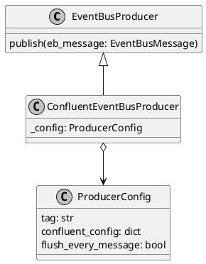
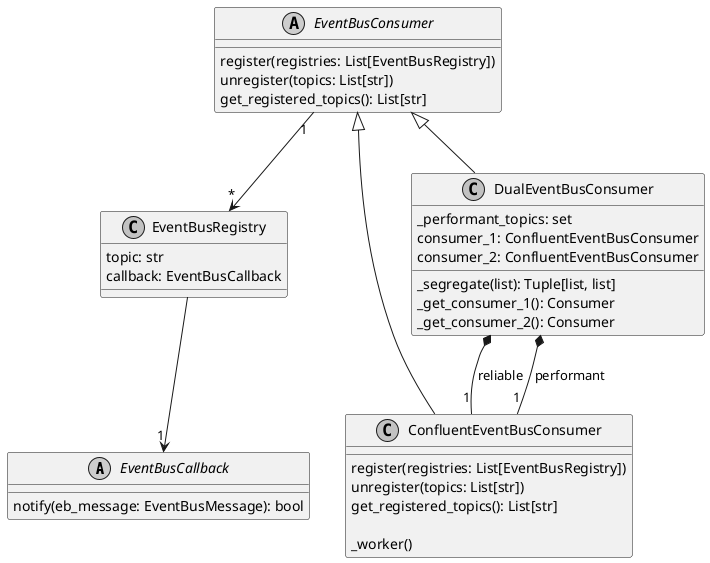
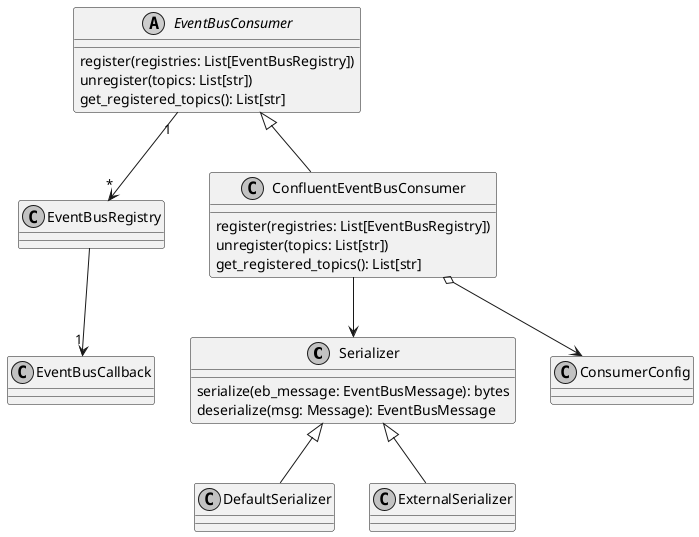
```plantuml
@startuml RouterSecure-Adaptor Component Diagram
!include C4-PlantUML/C4_Component.puml

title RouterSecure-Adaptor Overview Component Diagram


System_Boundary(container, "RSAdaptor") {

System_Boundary(domain, "Domain Layer") {

	Component(builders, "builders", "python package", "Translate ASM RouterSecure messages into HS Admin messages")

System_Boundary(hs_models, "HS Admin models") {
	Component(device_models, "device_models", "python module")

	Component(system_models, "system_models", "python module")
}

}

System_Boundary(app, "Application Layer") {

	Component(use_cases, "Use Cases", "python package", "RSDeviceCreated is consumed, RSDeviceUpdated is consumed, RSDeviceDeleted is consumed")

	Component(rest_client, "rest_client", "python module", "Holds HS Admin API base URL, client certificate, and implements request retry logic.")
}

System_Boundary(infra, "Infrastructure Layer") {

	Component(eventbus, "eventbus", "python package", "Consumes messages from ASM Kafka")

	' Component(hs_eventbus, "hs_eventbus", "python package", "Produces messages into HS-BE Kafka")

	Component(hs_requester, "hs_requester", "python package", "Perform requests to HS Admin REST")
}

}

Container_Boundary(rsclient, "RSClient")
Container_Boundary(rsagents, "RSAgents")

System(hsadmin, "HS-BE", "")

Rel(rsclient, eventbus, "RSDeviceCreated, RSDeviceUpdated, RSRouterProtectionUpdated, RSSystemUpdated")
Rel(rsagents, eventbus, "RSAgentsUpdated, RSDefaultAgentsUpdated")

' Rel(hs_eventbus, hsadmin, "DeviceConfiguration", "Kafka")
Rel(hs_requester, hsadmin, "POST /devices, PUT/DELETE /devices/{device_id}, GET /status", "REST")

Rel(eventbus, use_cases, "Consumes ASM RS Configuration")
Rel(use_cases, builders, "Builds HS Admin configuration")
' Rel(use_cases, rest_client, "")
Rel(rest_client, hs_requester, "Posts HS configuration messages")

Rel(builders, system_models, "build HS Adminconfiguration")
Rel(builders, device_models, "build HS Adminconfiguration")

' Rel(use_cases, hs_eventbus, "Prduces HS Adminconfiguration")

@enduml
```
```plantuml
@startuml RouterSecure-Adaptor Component Diagram
!include C4-PlantUML/C4_Component.puml

title RouterSecure-Adaptor Domain Layer Component Diagram

Component(use_cases, "usecases", "python package")


System_Boundary(domain, "Domain Layer") {

	Component(builders, "builders", "python package", "Translate ASM RouterSecure messages into HS Admin messages")

	Component(json_document, "json_document", "python module", "Map domain entities to python dictionary/JSON")

System_Boundary(hs_models, "HS Admin models") {

	Component(device_models, "device_models", "python module")

	Component(system_models, "system_models", "python module")

	Rel(device_models, json_document, "depends")
	Rel(system_models, json_document, "depends")
}

}

Rel(use_cases, builders, "build")

Rel(builders, system_models, "creates")
Rel(builders, device_models, "creates")


@enduml
```
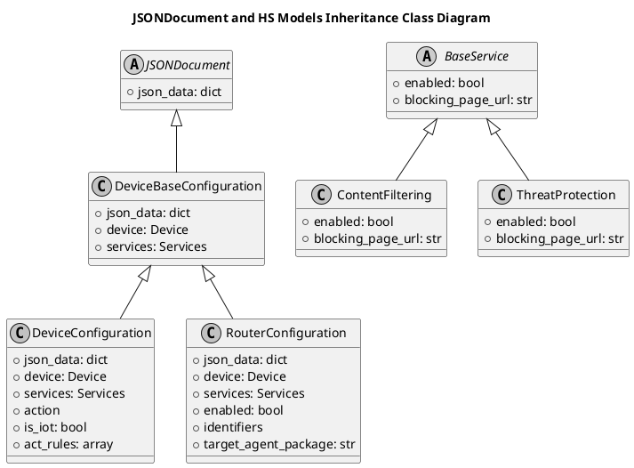
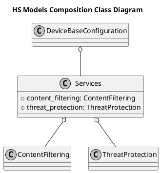
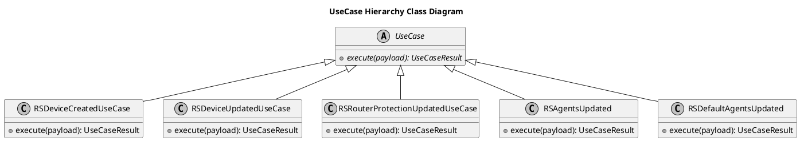
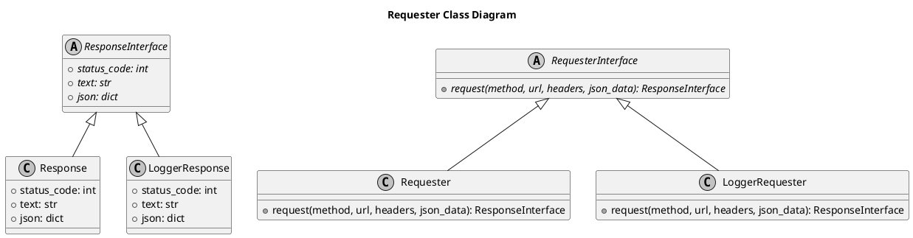
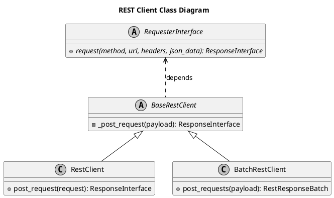
```plantuml
@startuml RouterSecure-Adaptor Component Diagram
!include C4-PlantUML/C4_Component.puml

title RouterSecure-Adaptor Overview Component Diagram


Container_Boundary(rsclient, "RSClient")

Container_Boundary(rsadaptor, "RSAdaptor") {

	System_Boundary(infra, "Infrastructure Layer") {

		Component(eventbus, "eventbus", "python package", "Consumes messages from ASM Kafka")

		' Component(hs_eventbus, "hs_eventbus", "python package", "Produces messages into HS-BE Kafka")

		Component(hs_requester, "hs_requester", "python package", "Posts requests to HS Admin")

		Component(env_settings, "env_settings", "python module", "Env var based settings")
	}

}


System(hsadmin, "HS-BE", "")

Rel(rsclient, eventbus, "RSDeviceUpdated")

' Rel(hs_eventbus, hsadmin, "device_configuration", "Kafka")
Rel(hs_requester, hsadmin, "GET /status", "REST")


@enduml
```
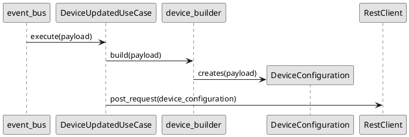
```plantuml
@startuml

skinparam monochrome true

event_bus -> RouterProtectionUpdatedUseCase: consumes(payload)

RouterProtectionUpdatedUseCase -> builders: build(payload)

builders -> SystemRouterDNS *: creates

builders -> SystemRouterAllowedIP *: creates

' RouterProtectionUpdatedUseCase -> hs_event_bus: produce(system_router_dns)

' RouterProtectionUpdatedUseCase -> hs_event_bus: produce(system_router_allowed_ip)

RouterProtectionUpdatedUseCase -> RestClient: post_request(system_router_dns)

RouterProtectionUpdatedUseCase -> RestClient: post_request(system_router_allowed_ip)

' RestClient -> hs_requester: request(device_configuration)

@enduml
```
```plantuml

@startuml ASM RouterSecure Container Diagram

!includeurl C4-PlantUML/C4_Component.puml


System_Boundary(asm, "ASM Core") {

	' Container(gatewayisp, "gateway-isp", "python")
	' Container(apiaccount, "apiaccount", "python")
	Container(accounts, "accounts", "python")
	Container(customconfig, "customconfig", "python")
	Container(subsystem_supervisor, "subsystem_supervisor", "python")

	' Rel(gatewayisp, accounts, "POST /accounts")
	' Rel(apiaccount, accounts, "POST /users")
	Rel(customconfig, accounts, "?")
}

System_Boundary(buckets, "ASM Reporting & Notifications") {
	Container(bucket_writer, "bucket-writer", "python")
	Container(notifications, "notifications", "python")
}

System_Boundary(rs, "ASM RouterSecure") {

	Container(rsclient, "routersecure-client", "python", "Account, user, device, ISP and RouterSecure-specific configuration and management")
	Container(rsadaptor, "routersecure-adaptor", "python", "Translates ASM RouterSecure messages into RouterSecure Admin messages")

	'Container(rsagents, "routersecure-agents", "python", "Agent Version packages and default Agent Version mapping")

	Container(rsevents, "routersecure-events", "python")

	Rel(rsclient, subsystem_supervisor, "ProductIsInstalled")

	Rel(accounts, rsclient, "UserUpdated")
	Rel(rsclient, rsadaptor, "RSDeviceUpdated", "Kafka Topic as-rs-provision-topic")

	'Rel(rsagents, rsclient, "RSDefaultAgentsUpdated")
	'Rel(rsagents, rsadaptor, "RSAgentsUpdated, 	RSDefaultAgentsUpdated")
}

System(hsbe, "HomeSecure Backend")

Rel(rsadaptor, hsbe, "device_configuration, router_configuration", "Kafka Account Topic", "HomeSecure Admin Interface")
Rel(rsadaptor, hsbe, "system_router_allowed_ip, system_router_dns, system_agent_versions", "Kafka System Topic", "HomeSecure Admin Interface")

Rel(rsevents, bucket_writer, "WSPRequest", "Kafka")
Rel(rsevents, notifications, "", "Kafka")
Rel(rsevents, accounts, "RSDeviceEventConnected", "Kafka Topic as-rs-event-topic")


Rel(hsbe, rsevents, "device_event_connected", "Kafka", "RouterSecure Event Interface")


@enduml
```
```plantuml

@startuml RSClient and RSAdaptor Container Diagram

!includeurl C4-PlantUML/C4_Component.puml

System_Boundary(asm, "ASM Core") {

	Container(accounts, "accounts", "python")
	Container(gateway_isp, "gateway-isp", "python", "ISP API Gateway, API Validation")
	Rel(gateway_isp, accounts, "[POST] /accounts")
}

System_Boundary(rs, "ASM RouterSecure") {

	Container(rsclient, "routersecure-client", "python", "Account, User, Device, ISP, Product-specific Configuration and Management")
	Container(rsadaptor, "routersecure-adaptor", "python", "Translates ASM RouterSecure messages into HS messages")

	Rel(accounts, rsclient, "AccountCreated, AccountUpdated, UserCreated, UserUpdated, DeviceCreated, DeviceDeleted")
	Rel(gateway_isp, rsclient, "[GET/PUT] /router-protection, [GET/PUT] /router-protection/dns-allowed-list")

	Rel(rsclient, rsadaptor, "RSDeviceCreated, RSDeviceUpdated, RSDeviceDeleted, RSDeviceAction", "Kafka as-rs-provision-topic")
	Rel(rsclient, rsadaptor, "RSRouterProtectionUpdated", "Kafka as-rs-system-configuration-topic")

	' Rel(rsclient, rsadaptor, "RSAgentsUpdated, RSDefaultAgentsUpdated", "Kafka as-rs-system-configuration-topic")
}

System(hsbe, "HS Backend")

Rel(rsadaptor, hsbe, "device_configuration, router_configuration", "REST Interface")
Rel(rsadaptor, hsbe, "system_router_allowed_ip, system_router_dns, system_general, system_agent_versions, system_agent_default", "REST Interface")


@enduml
```
```plantuml

@startuml RSClient and RSAdaptor Container Diagram

!includeurl C4-PlantUML/C4_Component.puml

System_Boundary(asm, "ASM Core") {

	Container(accounts, "accounts", "python")
}

System_Boundary(rs, "ASM RouterSecure") {

	Container(rsclient, "routersecure-client", "python", "Account, User, Device, ISP, Product-specific Configuration and Management")
	Container(rsadaptor, "routersecure-adaptor", "python", "Translates ASM RouterSecure messages into HS messages")

	Container(rsevents, "routersecure-events", "python")

	Rel(accounts, rsclient, "DeviceCreated", "Kafka Topic as-rs-provision-topic", "The new device has been provisioned")

	Rel(rsclient, rsadaptor, "RSDeviceCreated", "Kafka as-rs-provision-topic")

	Rel(rsevents, accounts, "RSDeviceEventConnected", "Kafka Topic as-rs-event-topic")
}


System(hsbe, "HS Backend")

Rel(rsadaptor, hsbe, "device_configuration", "Kafka Account Topic", "HS Admin Interface")

Rel(hsbe, rsevents, "device_event_connected", "Kafka", "RouterSecure Event Interface")


@enduml
```
```plantuml

@startuml RSAgents, RSClient, RSAdaptor Container Diagram

!includeurl https://raw.githubusercontent.com/RicardoNiepel/C4-PlantUML/release/1-0/C4_Container.puml
!includeurl https://raw.githubusercontent.com/RicardoNiepel/C4-PlantUML/release/1-0/C4_Context.puml

Person(isp, "ISP")


System_Boundary(c1, "RouterSecure Subsystem") {

	Container(rsclient, "routersecure-client", "python", "Account, User, Device, ISP, RS-specific Configuration and Management, Association of Router Device Target Version to Agent Version package")

	Container(rsadaptor, "routersecure-adaptor", "python", "Translates ASM RS messages into HS Admin messages")

	Rel(rsclient, rsadaptor, "RSUserUpdated", "Kafka Topic as-rs-provision-topic")

	Container(rsagents, "routersecure-agents", "python", "Agent Version packages, default Agent Version mapping")

	' ContainerDb(rsagents_db, "routersecure-agents-db", "MongoDB", "Agent Version packages")

	' Rel(rsagents, rsagents_db, "insert_one(...), delete_one(...)")


	Rel(rsagents, rsclient, "RSDefaultAgentsUpdated", "Kafka Topic as-rs-agent-topic")
	Rel(rsagents, rsadaptor, "RSAgentsUpdated, RSDefaultAgentsUpdated", "Kafka Topic as-rs-agent-topic")

	Rel(rsagents, rsclient, "DELETE /router_agent_packages/references/{agent_package_id}", "HTTP REST, 204 Success, 409 Conflict if Agent Version is in use")
}

System(hsbe, "HomeSecure Backend")

Rel(rsadaptor, hsbe, "system_agent_versions", "Kafka")

Rel(hsbe, rsagents, "GET /router_agent_packages/{router_package_id}", "Kafka")

Rel(isp, rsagents, "POST, PATCH, DELETE /router_agent_packages/{router_package_id}", "REST")

Rel(isp, rsclient, "PUT /subsystems/rs/router_agent_packages/{router_package_id}", "REST")

@enduml
```
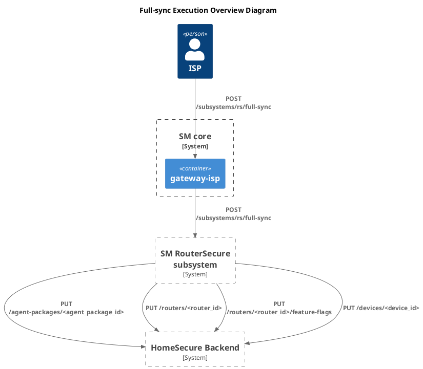
```plantuml
@startuml
!include <C4/C4_Container>
title Full-sync Orchestration Container Diagram

Person(isp, "ISP")

System_Boundary(c1, "RouterSecure Subsystem") {

	Container(rssync, "rssync", "python", "")
	Container(rsclient, "rsclient", "python", "")
	Container(rsagents, "rsagents", "python", "")

	System_Boundary(c2, "rsadaptor") {
		Container(rsadaptor, "rsadaptor", "python", "")
	}

	Rel(rssync, rsagents, "RSSyncAgentPackages", "as-rs-agents-request-topic", "(2)")
	Rel(rssync, rsclient, "RSSyncAccounts", "as-rs-client-request-topic", "(6)")

	Rel(rsclient, rsclient, "RSSyncAccountsBulk", "as-rs-client-request-topic", "(7)")
	Rel(rsagents, rsagents, "RSSyncAgentPackagesBulk", "as-rs-agent-request-topic", "(3)")

	Rel(rsclient, rsadaptor, "RSDeviceCreated", "as-rs-provision-topic", "(8)")
	Rel(rsagents, rsadaptor, "RSAgentPackageCreated", "as-rs-agent-topic", "(4)")
}

Rel(isp, rssync, "POST /subsystems/rs/full-sync", "REST", "(1)")

System(hsbe, "HomeSecure Backend")

Rel(rsadaptor, hsbe, "PUT agent-package", "REST", "(5)")
Rel(rsadaptor, hsbe, "PUT device", "REST", "(9)")

@enduml
```
```plantuml
@startuml

title Request/Reply Container Diagram #1 - rsclient
!include <C4/C4_Container>
Person(isp, "ISP")

System_Boundary(c1, "RouterSecure Subsystem") {

	Container(rssync, "rssync", "python", "")
	Container(rsclient, "rsclient", "python", "")
	Container(rsadaptor, "rsadaptor", "python", "")

	Rel(isp, rssync, "POST /subsystems/rs/full-sync", "REST", "(1)")

	Rel(rssync, rsclient, "RSSyncAccounts", "as-rs-client-request-topic", "(2)")
	Rel(rsclient, rssync, "RSSyncAccountsReply", "as-rs-client-reply-topic", "(8)")

	Rel(rsclient, rsclient, "RSSyncAccountsBulk", "as-rs-client-request-topic", "(3)")
	Rel(rsclient, rsclient, "RSSyncAccountsBulkReply", "as-rs-client-reply-topic", "(7)")

	Rel(rsclient, rsadaptor, "RSDeviceCreated", "as-rs-provision-topic", "(4)")
	Rel(rsadaptor, rsclient, "RSDeviceCreatedReply", "as-rs-adaptor-reply-topic", "(6)")

	' Rel(rsclient, rsadaptor, "RSCustomFlagsUpdated", "as-rs-provision-topic")
	' Rel(rsclient, rsadaptor, "RSRouterUploadIntervalsUpdated", "as-rs-provision-topic")
}

System(hsbe, "HomeSecure Backend")

Rel(rsadaptor, hsbe, "PUT device", "REST", "(5)")

@enduml
```
```plantuml
@startuml

title Request/Reply Container Diagram #2 - rsagents
!include <C4/C4_Container>
Person(isp, "ISP")

System_Boundary(c1, "RouterSecure Subsystem") {

	Container(rssync, "rssync", "python", "")
	Container(rsagents, "rsagents", "python", "")
	Container(rsadaptor, "rsadaptor", "python", "")

	Rel(isp, rssync, "POST /subsystems/rs/full-sync", "REST", "(1)")

	Rel(rssync, rsagents, "RSSyncAgentPackages", "as-rs-agents-request-topic", "(2)")
	Rel(rsagents, rssync, "RSSyncAgentPackagesReply", "as-rs-agents-reply-topic", "(8)")

	Rel(rsagents, rsagents, "RSSyncAgentPackagesBulk", "as-rs-agents-request-topic", "(3)")
	Rel(rsagents, rsagents, "RSSyncAgentPackagesBulkReply", "as-rs-agents-reply-topic", "(7)")

	Rel(rsagents, rsadaptor, "RSAgentPackageCreated", "as-rs-agent-topic", "(4)")
	Rel(rsadaptor, rsagents, "RSAgentPackageCreatedReply", "as-rs-adaptor-reply-topic", "(6)")
}

System(hsbe, "HomeSecure Backend")
Rel(rsadaptor, hsbe, "PUT agent-package", "REST", "(5)")
@enduml
```
```plantuml
@startuml

title Full Sync Execution Sequence Diagram

participant gateway_isp <<service>>
participant rssync <<service>>
participant rsagents <<service>>
participant rsclient <<service>>
participant rsadaptor <<service>>
participant HS_BE #ffffff

-> gateway_isp: POST\n/subsystems/rs/full-sync
gateway_isp -> rssync: RSSyncAll
rssync -> rsagents: RSSyncAgentPackages
rssync -> gateway_isp: HTTP 204
<- gateway_isp: HTTP 204
rsagents -> rsagents: RSSyncAgentPackagesBulk x N
rsagents -> rsadaptor: RSAgentPackageCreated x M
rsadaptor -> HS_BE: PUT agent-package
HS_BE -> rsadaptor: 204
rsadaptor -> rsagents: RSAgentPackageCreatedReply x M
rsagents -> rsagents: RSSyncAgentPackagesBulkReply x N
rsagents -> rssync: RSSyncAgentPackagesReply
rssync -> rsclient: RSSyncAccounts
rsclient -> rsclient: RSSyncAccountsBulk x N
rsclient -> rsadaptor: RSDeviceCreated x M
rsadaptor -> HS_BE: PUT device
HS_BE -> rsadaptor: 204
rsadaptor -> rsclient: RSDeviceCreatedReply x M
rsclient -> rsclient: RSSyncAccountsBulkReply x N
rsclient -> rssync: RSSyncAccountsReply

@enduml
```
```plantuml
@startuml

title Full Sync Cancellation Sequence Diagram

participant gateway_isp <<service>>
participant rssync <<service>>
participant rsagents <<service>>
participant rsclient <<service>>
participant rsadaptor <<service>>
participant HS_BE #ffffff

-> gateway_isp: POST\n/subsystems/rs/jobs/<job-id>
gateway_isp -> rssync: RSCancelSync(\n  job_id\n)
rssync -> rsagents: RSCancelSync(\n  job_id\n)
rssync -> rsclient: RSCancelSync(\n  job_id\n)
rssync -> gateway_isp: HTTP 204
<- gateway_isp: HTTP 204
rsagents -> rsagents: cancel_async_tasks(\n  job_id\n)
rsclient -> rsclient: cancel_async_tasks(\n  job_id\n)
rsclient <- rsadaptor: RSDeviceCreatedReply(\n  request_id\n) # discarded

@enduml
```
```plantuml
@startuml


title AsyncTask Class Diagram


' abstract class AsyncTaskResult <<abstract>> #ffffff {
' 	+ completed: bool
' }

package sm.async_task.models {

	class Reply {
		status: str
		timestamp: datetime
	}

	class Request {
		+ request_id: str	# Correlation id
		+ event_type: str
		+ payload: dict
		+ timestamp: datetime
		+ reply: Reply
	}

	Request o-> Reply

	class Task {
		- task_id: str # E.g. SyncAll_JmMxFFq
		- task_type: str # E.g. SyncAll
		- requests: List[Request]
		- add_request(request: Request)
		- to_document(task_doc: dict)
		- from document(task_doc: dict)
	}

	Task o-> Request

}


abstract class AsyncTask <<abstract>> #ffffff {
	- task: Task
	- _manager: AsyncTaskManager
	+ {abstract} start(payload, transaction): AsyncTaskResult
	+ {abstract} dispatch_event(event_type, payload, transaction): AsyncTaskResult
	+ validate_event_type()
	+ publish_requests(List[requests])
}

Task <--o AsyncTask

class AsyncTaskManager {
	+ insert_async_task(task_doc: dict)
	+ find_async_task_by_request(request_id: str): dict
	+ update_async_task(task: Task, replied_request: Request, added_requests: List[Request])
	+ delete_async_task(at_id: str)
}

abstract class Collection <<abstract>> #ffffff {
	+ insert_one()
	+ find_one()
	+ update_one()
	+ delete_one()
	+ find()
}

AsyncTaskManager --> Collection

class SyncAllAsyncTask {
	+ start(payload, transaction): AsyncTaskResult
	+ dispatch_event(event_type, payload, transaction): AsyncTaskResult
	- _transition_step_0_sync_system()
	- _transition_step_1_sync_agent_packages()
	- _transition_step_2_sync_accounts()
	- _continue_step_2_sync_accounts()
}

AsyncTask <|-- SyncAllAsyncTask

AsyncTask ----> AsyncTaskManager

SyncAllUseCase -.-> SyncAllAsyncTask: instantiates
SyncAllUseCase -.-> SyncAllAsyncTask: start()

SyncAgentPackagesReplyUseCase -.-> AsyncTaskManager: find_async_task_by_request()
SyncAgentPackagesReplyUseCase -.-> SyncAllAsyncTask: instantiates
SyncAgentPackagesReplyUseCase -.-> SyncAllAsyncTask: dispatch_event()

' SyncAllUseCase ----> AsyncTaskManager
' SyncAgentPackagesReplyUseCase ----> AsyncTaskManager

@enduml
```
```plantuml
@startuml
title AsyncTask Sequence Diagram (Generic Use Case, Async Task Not Completed)

participant EventBusCallback #ffffff
participant UseCase #e2271a
participant AsyncTask #ef7c08
participant AsyncTaskManager #ffffff
participant Collection #ffffff

EventBusCallback -> UseCase: execute(payload)
UseCase -> AsyncTask: instantiates
UseCase -> AsyncTask: start(\n  payload,\n  transaction\n)
AsyncTask -> AsyncTask: _add_request(\n  request\n)
AsyncTask -> AsyncTaskManager: insert_async_task(\n  task_doc,\n  transaction\n)
AsyncTaskManager -> Collection: insert_one(task_doc)
AsyncTask -> AsyncTask: _publish_requests()
AsyncTask -> EventBusProducer: publish(\n  event_type="RSSyncXXX"\n)
AsyncTask -> UseCase: AsyncTaskResult(\n  completed=False\n)
@enduml
```
```plantuml
@startuml
title AsyncTask Sequence Diagram (Generic Reply Use Case, Async Task Not Completed)

participant ReplyUseCase #e2271a
participant AsyncTask #ef7c08
participant AsyncTaskManager #ffffff

ReplyUseCase -> EventBusMessage: get_payload()
ReplyUseCase -> AsyncTaskManager: find_async_task_by_request(\n  request_id\n)
ReplyUseCase -> AsyncTask: dispatch_event(eb_message)
AsyncTask -> AsyncTask: _assign_request_reply(request_id)
AsyncTask -> AsyncTask: _add_request(request_id)
AsyncTask -> AsyncTaskManager: update_async_task(\n  task_doc,\n  replied_request,\n  added_requests\n)
AsyncTask -> AsyncTask: _publish_requests()
AsyncTask -> EventBusProducer: publish(new_request)
AsyncTask -> ReplyUseCase: AsyncTaskResult(\n  completed=False\n)

@enduml
```	
```plantuml
@startuml
title AsyncTask Sequence Diagram (Generic Reply Use Case, Async Task Completed)

participant ReplyUseCase #e2271a
participant AsyncTask #ef7c08
participant AsyncTaskManager #ffffff

ReplyUseCase -> EventBusMessage: get_payload()
ReplyUseCase -> AsyncTaskManager: find_async_task(request_id)
ReplyUseCase -> AsyncTask: dispatch_event(eb_message)
AsyncTask -> AsyncTask: _assign_request_reply(request_id)
AsyncTask -> AsyncTaskManager: delete_async_task(\n  task_doc\n)
AsyncTask -> ReplyUseCase: AsyncTaskResult(\n  completed=True\n)
ReplyUseCase -> EventBusProducer: publish(event_type="RSSyncXXXReply")

@enduml
```
```plantuml
@startuml
title SyncAllAsyncTask Sequence Diagram (SyncAllUseCase, Step #0)

participant SyncAllResource
participant SyncAllUseCase #e2271a
participant SyncAllAsyncTask #ef7c08

SyncAllResource -> SyncAllUseCase: execute(payload)
SyncAllUseCase -> SyncAllAsyncTask: instantiate
SyncAllUseCase -> SyncAllAsyncTask : start()
SyncAllAsyncTask -> SyncAllAsyncTask : _transition_step_0_sync_agent_packages()
SyncAllAsyncTask -> SyncAllAsyncTask : _add_request(\n  request\n)
SyncAllAsyncTask -> AsyncTaskManager : insert_async_task(\n  task_doc\n)
AsyncTaskManager -> Collection : insert_one(\n  task_doc\n)
SyncAllAsyncTask -> SyncAllAsyncTask: _publish_requests()
SyncAllAsyncTask -> EventBusProducer : publish(\n  "RSSyncAgentPackages"\n)
SyncAllAsyncTask -> SyncAllUseCase: AsyncTaskResult(\n  completed=False\n)
SyncAllUseCase -> SyncAllResource: UseCaseResult(\n  status_code=204,\n  response=running\n)

@enduml
```
```plantuml
@startuml
title SyncAllAsyncTask Sequence Diagram (SyncAgentPackagesReplyUseCase, Step #1)

participant SyncAgentPackagesReplyUseCase #f7c095
participant SyncAllAsyncTask #ef7c08

SyncAgentPackagesReplyUseCase -> EventBusMessage : get_payload()
SyncAgentPackagesReplyUseCase -> AsyncTaskManager : find_async_task_by_request(request_id)
SyncAgentPackagesReplyUseCase -> SyncAllAsyncTask : dispatch_event(\n  "RSSyncAgentPackagesReply"\n)
SyncAllAsyncTask -> SyncAllAsyncTask: _assign_request_reply(\n  request_id\n)_
SyncAllAsyncTask -> SyncAllAsyncTask : _transition_step_1_sync_accounts_()
SyncAllAsyncTask -> SyncAllAsyncTask: _add_request(new_request_doc)
SyncAllAsyncTask -> AsyncTaskManager : update_async_task(\n  task_doc,\n  replied_request_doc,\n  new_request_doc\n)
AsyncTaskManager -> Collection : update_one(\n  task_doc\n)
SyncAllAsyncTask -> SyncAllAsyncTask: _publish_requests()
SyncAllAsyncTask -> EventBusProducer : publish(\n  "RSSyncAccounts"\n)

@enduml
```
```plantuml
@startuml
title SyncAllAsyncTask Sequence Diagram (SyncAccountsReplyUseCase, Step #1 Completed)

participant SyncAccountsReplyUseCase #f7c095
participant SyncAllAsyncTask #ef7c08

SyncAccountsReplyUseCase -> EventBusMessage : get_payload()
SyncAccountsReplyUseCase -> AsyncTaskManager : find_async_task(request_id)
SyncAccountsReplyUseCase -> SyncAllAsyncTask : dispatch_event(\n  "RSSyncAccountsReply"\n)
SyncAllAsyncTask -> SyncAllAsyncTask: _assign_request_reply()
SyncAllAsyncTask -> SyncAllAsyncTask : _continue_step_1_sync_accounts_()
SyncAllAsyncTask -> SyncAllAsyncTask : _update_async_task(\n  request_doc\n  replied_request_doc\n)
SyncAllAsyncTask -> AsyncTaskManager : update_one(\n  task_doc\n)
AsyncTaskManager -> Collection : update_one(\n  request_id\n)
SyncAllAsyncTask -> SyncAccountsReplyUseCase: AsyncTaskResult(\ncompleted=True\n)

@enduml
```
```plantuml
@startuml
!include <C4/C4_Component>


System_Boundary(domain, "sm.async_tasks") {

	Component(models, "models", "python module", "Task, Request and Reply classes")
	Component(async_tasks, "async_tasks", "python module")
	Component(async_task_manager, "async_task_manager", "python module")
	Rel(async_tasks, models, "")
	Rel(async_task_manager, models, "")
	Rel(async_tasks, async_task_manager, "")
}
System_Boundary(rsclient, "rsclient") {
	Component(sync_accounts_task, "sync_accounts_task", "python module")
}
System_Boundary(rsagents, "rsagents") {
	Component(sync_agent_packages_task, "sync_agent_packages_task", "python module")
}
Rel(sync_accounts_task, domain, "")
Rel(sync_agent_packages_task, domain, "")

Component(database_c, "database", "python module")
Rel(async_task_manager, database_c, "")

@enduml
```
```plantuml
@startuml

skinparam monochrome true

event_bus-> UseCase: execute(payload, trace_id)

UseCase -> CRUD: create/read/update/delete

UseCase -> Builder: build(EntityActionType)

Builder -> UseCase: publish(BuildedMessage)

@enduml
```
```plantuml
@startuml RouterSecure Client Container Diagram

!include https://raw.githubusercontent.com/plantuml-stdlib/C4-PlantUML/master/C4_Component.puml

title RouterSecure Client Container Diagram

System_Boundary(ASM, "ASM")
Container_Boundary(RSClient, "RSClient"){
    System_Boundary(infrastructur, "Infrastructure Layer"){
        Component(eventbus, "eventbus", "Python Package", "Consumes messages from Kafka")
        Component(rest_server, "rest_server", "Python Package", "Recieves REST API calls")
    }
    System_Boundary(application, "Application Layer", "Python"){
        Component(usecases, "UseCases", "Account/User/Device create/update/delete")
    }
    System_Boundary(domain, "Domain Layer"){
        Component(builders, "Message Builders", "TBD")
    }
}
Container_Boundary(RSAdaptor, "RSAdaptor")
Container_Boundary(HS_BE, "HS-BE")

Rel(ASM, eventbus, "kafka", "ASM publishing Kafka message, RSClient consuming Kafka messages")
Rel(ASM, rest_server, "request", "ASM sends request")

Rel(eventbus, usecases, "execute", "Callback instatiate usecase and call execute")
Rel(rest_server, usecases, "execute", "Resource instatiate usecase and call execute")

Rel(usecases, builders, "build", "ASM sends request")
Rel(usecases, RSAdaptor, "kafka", "RSClient publishing Kafka message, RSAdaptor consuming Kafka messages")

Rel(RSAdaptor, eventbus, "kafka", "RSAdaptor publishing Kafka message, RSClient consuming Kafka messages")
Rel(RSAdaptor, HS_BE, "kafka", "RSAdaptor publishing Kafka message, HS-BE consuming Kafka message")

@enduml
```
```plantuml
@startuml RouterSecure Client Component Infrastrucre Layer Diagram
!include https://raw.githubusercontent.com/plantuml-stdlib/C4-PlantUML/master/C4_Component.puml

title RouterSecure Client Component Infrastrucre Layer Diagram

LAYOUT_LEFT_RIGHT()

Container_Boundary(kafka, "Kafka container")
Container_Boundary(asm, "ASM")
System_Boundary(application, "Application")

System_Boundary(infrastructure, "Infrastructure Layer"){
    System_Boundary(db, "Database"){
        Component(__init__, "__init__", "Python", "MongoDataFacade creation")
        Component(account_collection, "account_collection", "Python", "Account Collection")
        Component(user_collection, "user_collection", "Python", "User Collection")
        Component(device_collection, "device_collection", "Python", "Device Collection")
        Component(service_configuration_collection, "service_configuration_collection", "Python", "ISP Service Configuration and RS Advanced Configuration Collection")
        Component(TBD, "TBD", "Python", "Need to define more collections for router protection, lan protection etc")
    }
    
    System_Boundary(eventbus, "Kafka"){
        Component(__init__, "__init__", "Python", "Kafka EventBusFacade creation")
        Component(account_callback, "account_callback", "Python", "Account events callback")
        Component(user_callback, "user_callback", "Python", "User events callback")
        Component(device_callback, "device_callback", "Python", "Device events callback")
        Component(provision_callback, "provision_callback", "Python", "Provision events callback")
        Component(service_configuration_callback, "service_configuration_callback", "Python", "ISP Service Configuration events callback")
    }

    System_Boundary(rest_server, "Flask"){
        Component(__init__, "__init__", "Python", "Flask and API instances creation")
        Component(advanced_configuration_resource, "advanced_configuration_resource", "Python", "RS Advanced Configuration Resource configuration")
        Component(lan_protection_resource, "lan_protection_resource", "Python", "Lan Protection Configuration Resource configuration")
        Component(router_allowed_list_resource, "router_allowed_list_resource", "Python", "Router Protection Allowed list configuration")
        Component(router_dns_allowed_list_resource, "router_dns_allowed_list_resource", "Python", "Router Protection DNS Allowed List configuration")
        Component(router_protection_resource, "router_protection_resource", "Python", "Router Protection configuration")
    }
}

Rel(kafka, account_callback, "consume", "AccountCreated, AccountUpdated, AccountDeleted")
Rel(kafka, user_callback, "consume", "UserCreated, UserUpdated, UserDeleted")
Rel(kafka, device_callback, "consume", "DeviceCreated, DeviceUpdated, DeviceDeleted")
Rel(kafka, provision_callback, "consume", "ProvisionCreated, ProvisionUpdated, ProvisionDeleted")
Rel(kafka, service_configuration_callback, "consume", "ISPGlobalConfigurationsCreated, ISPGlobalConfigurationsUpdated")

Rel(asm, advanced_configuration_resource, "JSON/HTTPS")
Rel(asm, lan_protection_resource, "JSON/HTTPS")
Rel(asm, router_allowed_list_resource, "JSON/HTTPS")
Rel(asm, router_dns_allowed_list_resource, "JSON/HTTPS")
Rel(asm, router_protection_resource, "JSON/HTTPS")

Rel(advanced_configuration_resource, asm, "JSONResponse")
Rel(lan_protection_resource, asm, "JSONResponse")
Rel(router_allowed_list_resource, asm, "JSONResponse")
Rel(router_dns_allowed_list_resource, asm, "JSONResponse")
Rel(router_protection_resource, asm, "JSONResponse")

Rel(account_callback, application, "execute", "Execute UseCase")
Rel(user_callback, application, "execute", "Execute UseCase")
Rel(device_callback, application, "execute", "Execute UseCase")
Rel(provision_callback, application, "execute", "Execute UseCase")
Rel(service_configuration_callback, application, "consume", "Execute UseCase")

Rel(advanced_configuration_resource, application, "execute", "Execute UseCase, if such event type received")
Rel(lan_protection_resource, application, "execute", "Execute UseCase, if such event type received")
Rel(router_allowed_list_resource, application, "execute", "Execute UseCase, if such event type received")
Rel(router_dns_allowed_list_resource, application, "execute", "Execute UseCase, if such event type received")
Rel(router_protection_resource, application, "execute", "Execute UseCase, if such event type received")

@enduml
```
```plantuml
@startuml RouterSecure Client Component Application Layer Diagram
!include https://raw.githubusercontent.com/plantuml-stdlib/C4-PlantUML/master/C4_Component.puml

title RouterSecure Client Component Application Layer Diagram

LAYOUT_LEFT_RIGHT()

System_Boundary(infrastructure, "Infrastructure Layer")

System_Boundary(app, "Application Layer"){
    System_Boundary(usecases, "UseCases"){
        Component(account_created, "account_created", "Python", "AccountCreatedUseCase")
        Component(account_updated, "account_updated", "Python", "AccountUpdatedUseCase")
        Component(account_deleted, "account_deleted", "Python", "AccountDeletedUseCase")
        Component(user_created, "user_created", "Python", "UserCreatedUseCase")
        Component(user_updated, "user_updated", "Python", "UserUpdatedUseCase")
        Component(user_deleted, "user_deleted", "Python", "UserDeletedUseCase")
        Component(device_created, "device_created", "Python", "DeviceCreatedUseCase")
        Component(device_updated, "device_updated", "Python", "DeviceUpdatedUseCase")
        Component(device_deleted, "device_deleted", "Python", "DeviceDeletedUseCase")
        Component(provision_created, "provision_created", "Python", "ProvisionCreatedUseCase")
        Component(provision_updated, "provision_updated", "Python", "ProvisionUpdatedUseCase")
        Component(provision_deleted, "provision_deleted", "Python", "ProvisionDeletedUseCase")
        Component(system_configuration_updated, "system_configuration_updated", "Python", "SystemConfigurationUpdatedUseCase")
        Component(router_protection, "router_protection", "Python", "RouterProtectionUpdatedUseCase, RouterProtectionGetUseCase")
        Component(router_protection_dns_allowed_list, "router_protection_dns_allowed_list", "Python", "RouterProtectionDNSAllowedListUpdatedUseCase, RouterProtectionDNSAllowedListGetUseCase")
        Component(router_protection_allowed_list, "router_protection_allowed_list", "Python", "RouterProtectionAllowedListUpdatedUseCase, RouterProtectionAllowedListGetUseCase")
        Component(lan_protection, "lan_protection", "Python", "LanProtectionUpdatedUseCase, LanProtectionGetUseCase")
    }
}

Rel(provision_created, account_created, "execute", "Execute UseCase, if such event type received")
Rel(provision_created, user_created, "execute", "Execute UseCase, if such event type received")
Rel(provision_created, device_created, "execute", "Execute UseCase, if such event type received")
Rel(provision_updated, account_updated, "execute", "Execute UseCase, if such event type received")
Rel(provision_updated, user_updated, "execute", "Execute UseCase, if such event type received")
Rel(provision_updated, device_updated, "execute", "Execute UseCase, if such event type received")
Rel(provision_deleted, account_deleted, "execute", "Execute UseCase, if such event type received")
Rel(provision_deleted, user_deleted, "execute", "Execute UseCase, if such event type received")
Rel(provision_deleted, device_deleted, "execute", "Execute UseCase, if such event type received")

Rel_L(infrastructure, usecases, "execute", "Execute UseCase")
System_Boundary(domain, "Domain Layer")
Rel_L(usecases, domain, "build", "Build message for RSAdaptor")

@enduml
```
```plantuml
@startuml RouterSecure Client Component Domain Layer Diagram
!include https://raw.githubusercontent.com/plantuml-stdlib/C4-PlantUML/master/C4_Component.puml

title RouterSecure Client Component Domain Layer Diagram

System_Boundary(app, "Application Layer")

System_Boundary(domain, "Domain Layer"){
    System_Boundary(builders, "Message Builders"){
        Component(TBD, "TBD", "Python", "Need to define all message builders.")
    }

    System_Boundary(datamodels, "RSClient Data Models") {
        Component(account, "account", "Python", "Account object builder")
        Component(user, "user", "Python", "User object builder")
        Component(device, "device", "Python", "Device object builder")
        Component(system_configuration, "system_configuration", "Python", "ISP System Configuration and RS Advanced Configuration object builder")
    }
}

Rel(app, TBD, "build", "Building message for RSAdaptor")

@enduml
```
```plantuml

@startuml

title Containers `accounts` and `accounts-rs-device-deletion-job` use `accounts` image.

!includeurl https://raw.githubusercontent.com/RicardoNiepel/C4-PlantUML/release/1-0/C4_Container.puml

!includeurl https://raw.githubusercontent.com/RicardoNiepel/C4-PlantUML/release/1-0/C4_Component.puml


Container(accounts, "accounts",					\
	"service",						\
	"N instances, REST and Kafka interfaces"		\
)

Container(accounts_rs_device_deletion,		\
	"accounts-rs-device-deletion-job",	\
	"job", 					\
	"1 instance, runs periodically, entrypoint is `products.routersecure.device_deletion_job`"	\
)

System_Boundary(images, "docker image repository") {
	Component(accounts_image, "accounts:latest", "docker image")
}

Rel(accounts, accounts_image, "image")
Rel(accounts_rs_device_deletion, accounts_image, "image")

@enduml
```
```plantuml

@startuml ASM RouterSecure Container Diagram

!includeurl https://raw.githubusercontent.com/RicardoNiepel/C4-PlantUML/release/1-0/C4_Container.puml
!includeurl https://raw.githubusercontent.com/RicardoNiepel/C4-PlantUML/release/1-0/C4_Context.puml


System_Boundary(asm, "ASM Core") {

	Container(accounts, "accounts",						\
		"python",							\
		"product_data.RouterSecure.status.is_new* product_data.RouterSecure.status.active* product_data.RouterSecure.status.active_timestamp*"	\
	)

}

System_Boundary(rs, "ASM RouterSecure") {

	Container(rsclient, "rsclient", "python", "")
	Container(rsevents, "rsevents", "python")
	Container(notifications, "notifications", "python", "")

	Rel(accounts, rsclient, "DeviceDeleted")
	Rel(accounts, notifications, "device_inactive_deleted, device_inactive_delete_alert")
}

System(hsbe, "HS Backend")

Rel(rsevents, accounts, "PostDevice, PatchDevice", "Kafka as-provision-command-topic")

Rel(hsbe, rsevents, "device_event_new_device, device_event_active", "Kafka")

System_Boundary(kubernetes, "Kubernetes") {
	'Component(cronjob, "CronJob", "")
}

Rel(kubernetes, accounts, "device_deletion_job", "Kubernetes CronJob")


@enduml
```
```plantuml
@startuml

skinparam monochrome true

activate DeviceCrudCallback
activate DeviceCrudHandler

activate DeletionTimestampService
activate ConfigurationCollection

activate DeviceCollection

DeviceCrudCallback -> DeviceCrudHandler : handle_patch_device(device)

DeviceCrudHandler -> DeletionTimestampService : inject_deletion_timestamp(device, account, internal)

DeletionTimestampService -> DeletionTimestampService: _get_active_status(device)
DeletionTimestampService -> DeletionTimestampService: _resolve_max_inactive_time(account)
DeletionTimestampService -> ConfigurationCollection : find_configuration(isp_account_configuration)

activate Context

DeviceCrudHandler -> Context : setattr(internal)
DeviceCrudHandler -> DeviceCollection : find_one_and_replace(ctx)
DeviceCollection -> DeviceCollection : _update_internal(ctx)

@enduml
```
```plantuml
@startuml

skinparam monochrome true

actor AccountManager

activate AccountResource

activate DeletionTimestampService
activate ConfigurationCollection

activate DeviceCollection


AccountManager -> AccountResource : PATCH account
AccountResource -> DeletionTimestampService : recalculate_deletion_timestamps(account)

DeletionTimestampService -> DeletionTimestampService: _get_active_status(device)
DeletionTimestampService -> DeletionTimestampService: _resolve_max_inactive_time(account)
DeletionTimestampService -> ConfigurationCollection : find_configuration(isp_account_configuration)

activate Context

DeviceCrudHandler -> Context : setattr(internal)
DeviceCrudHandler -> DeviceCollection : find_one_and_replace(ctx)
DeviceCollection -> DeviceCollection : _update_internal(ctx)

@enduml
```
```plantuml
@startuml

skinparam monochrome true

activate AccountDeviceResource
activate DeviceCrudCallback

AccountDeviceResource -> DeviceCrudHandler : handle_patch_device
DeviceCrudCallback -> DeviceCrudHandler : handle_patch_device(device)

DeviceCrudHandler -> RouterSecureProduct : validate(device)

DeviceCollection -> DeviceCollection : _update_internal(ctx)

@enduml
```
